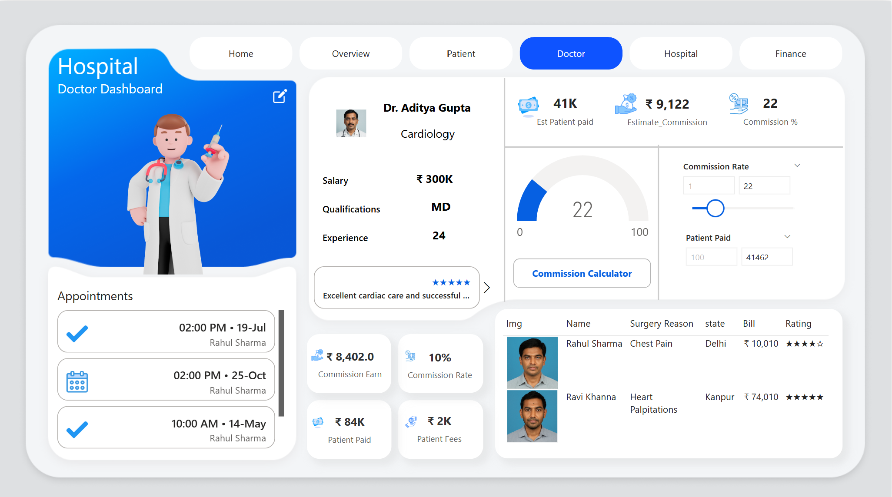
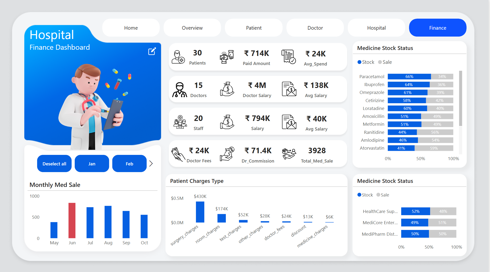
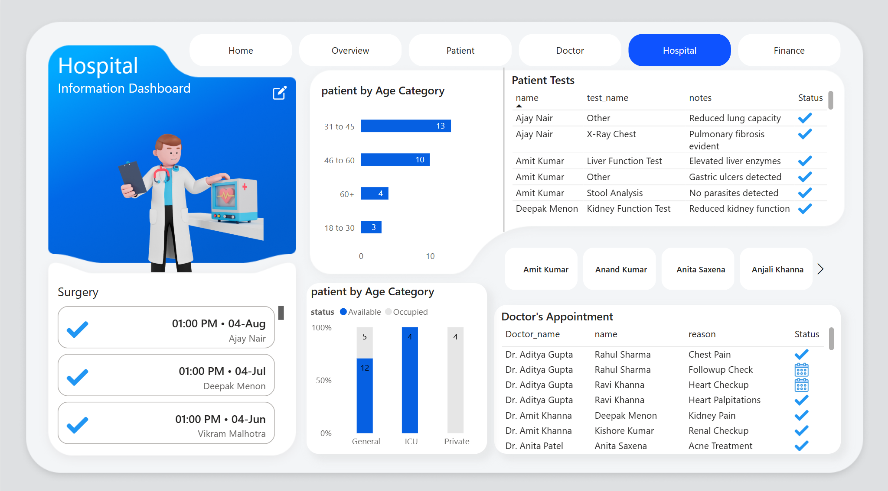
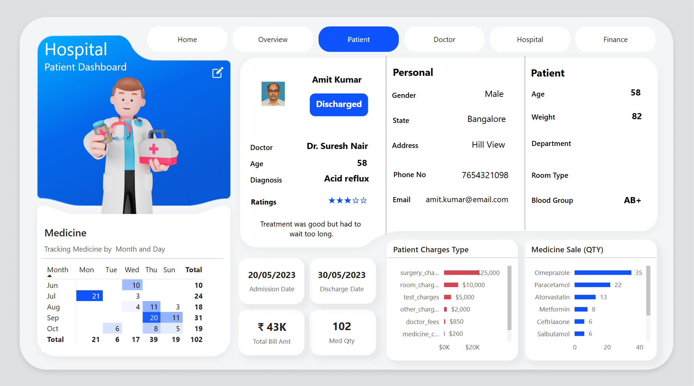
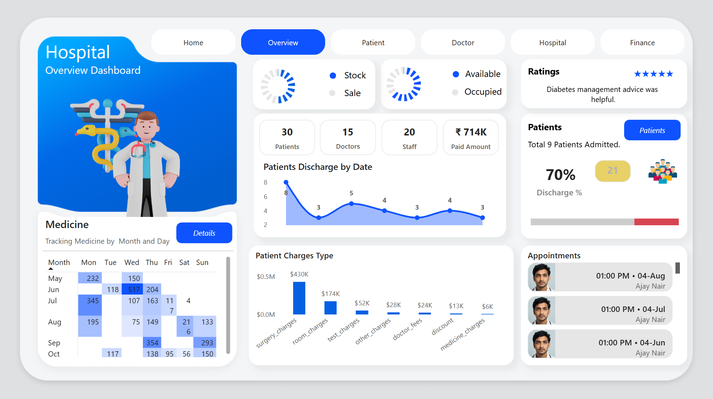

# 🏥 Hospital Analytics Dashboard – Power BI Project

  
A comprehensive, interactive hospital dashboard solution built using **Power BI** to visualize and optimize healthcare operations, financials, doctor performance, and patient insights.

---

## 📌 Project Overview

This project is designed to assist hospital administrators, doctors, and finance departments in monitoring and improving healthcare operations using centralized, data-driven dashboards.

From patient treatment to doctor salaries and medicine stock status – every important metric is visualized clearly in this solution.

---

## 📊 Key Dashboards

### 1. 👨‍⚕️ Doctor Dashboard
- Track commissions, salaries, and patient appointments.
- Live feedback and patient ratings.
- Commission calculator with dynamic inputs.

---

### 2. 💰 Finance Dashboard
- Monitor paid amounts, average spend, and salaries.
- Visualize monthly medicine sales and stock status.
- Patient charge type analysis.

---

### 3. 🏥 Hospital Dashboard
- Track surgeries and patient tests.
- Analyze age-wise patient demographics.
- Room occupancy and appointment summaries.

---

### 4. 🧑‍⚕️ Patient Dashboard
- Detailed patient profile: age, blood group, room type, doctor assigned.
- Billing breakdown by service category.
- Medicine usage and feedback tracking.

---

### 5. 📈 Overview Dashboard
- Consolidated hospital performance: admissions, discharges, ratings.
- Weekly medicine tracking.
- Patient count and charge breakdown.

---

## 🎯 Features

- ✅ **Real-time visual reporting**
- ✅ **User-friendly and clean design**
- ✅ **Interactive slicers and filters**
- ✅ **DAX-based dynamic measures**
- ✅ **Insightful analytics across all departments**

---

## 🛠 Tools & Technologies Used

| Tool        | Purpose                             |
|-------------|-------------------------------------|
| Power BI    | Dashboard design & data visualization |
| DAX         | Custom measures & calculations      |
| Excel       | Data preprocessing & transformation |

---

## 📈 Outcomes & Impact

- 🔹 Enhanced hospital decision-making with real-time metrics  
- 🔹 Improved transparency in doctor earnings and patient care  
- 🔹 Streamlined medicine tracking and stock alerts  
- 🔹 Visual financial health analysis of the hospital

---

## 🙋‍♂️ Author

**Sumit Chhillar**  
🔗 [LinkedIn](https://www.linkedin.com/in/sumit-chhillar-020a36323/)  
🐙 [GitHub](https://github.com/Sumit170694)

---

## 📢 Feedback & Contributions

If you found this project helpful or have ideas to improve it, feel free to ⭐ star the repo or connect with me!

---

